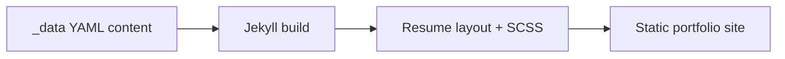

# Mystic Bytes — Cyberpunk Tech Portfolio

A Jekyll-powered developer resume with a dark cyberpunk aesthetic. Terminal-inspired design with neon accents, card-based layouts, and accessibility-first principles.

Live at: [gh.jenthedev.it.com](https://gh.jenthedev.it.com)

---

## 🎨 Design Features

### Color Palette
- **Background**: Deep navy/black (`#0a0e27`)
- **Accent Colors**:
  - Purple gradient (`#a78bfa` → `#7c3aed`)
  - Cyan highlights (`#22d3ee`)
  - Orange accents (`#fb923c`)
  - Green status badges (`#10b981`)

### Typography
- **Display Font**: Space Mono (monospace headers)
- **Body Font**: Inter (clean, readable)
- **Code Font**: Fira Code (with ligatures)

### Key Design Elements
- Card-based layouts with hover effects
- Gradient borders and text
- Status badges for skills and certifications
- Smooth animations and transitions
- Glowing accent effects
- Responsive grid layouts

---

## 🚀 Quick Start

### Prerequisites
- Ruby 3.x
- Bundler
- Jekyll

### Installation

```bash
git clone https://github.com/jen-the-dev/mysticbytes.git
cd mysticbytes
bundle install
bundle exec jekyll serve
```

Visit `http://localhost:4000`.

---

## 📁 Project Structure

```
mysticbytes/
├── _config.yml           # Site configuration, section toggles, social links
├── _data/                # All resume content lives here
│   ├── experience.yml    # Work history
│   ├── skills.yml        # Technical skills
│   ├── projects.yml      # Portfolio projects
│   ├── recognitions.yml  # Awards & certifications
│   ├── seeking.yml       # Current availability
│   ├── associations.yml  # (disabled)
│   ├── interests.yml     # (disabled)
│   └── links.yml         # (disabled)
├── _includes/            # Reusable components
│   ├── head.html         # HTML head with fonts
│   └── icon-links.html   # Social media icons
├── _layouts/
│   └── resume.html       # Main resume layout
├── _sass/
│   ├── _variables.scss   # Color/spacing variables
│   ├── _base.scss        # Base styles
│   ├── _mixins.scss      # Reusable mixins
│   ├── _layout.scss      # Layout utilities
│   └── _resume.scss      # Resume-specific styles
├── css/
│   └── main.scss         # Stylesheet entry point
├── images/               # Avatar and assets
└── index.html            # Homepage
```

---

## ✏️ Updating Content

All resume content lives in `_data/`. Edit the relevant file and push — GitHub Pages rebuilds automatically.

### Personal info and title

Edit `_config.yml`:

```yaml
resume_name: "Your Name"
resume_title: "Your Title"
resume_contact_email: "your@email.com"
resume_header_intro: "<p>Your introduction here.</p>"
```

### Experience

Edit `_data/experience.yml`:

```yaml
- company: Company Name
  position: Your Position
  duration: 2020 - Present
  summary: >
    Description of your role and achievements.
```

### Skills

Edit `_data/skills.yml`:

```yaml
- skill: "Skill Category"
  description: "Description of skills in this area."
```

### Projects

Edit `_data/projects.yml`:

```yaml
- project: Project Name
  role: Your Role
  duration: 2024 - Present
  url: "https://project-url.com"
  description: Project description.
```

### Toggle sections

In `_config.yml`, comment out any section to hide it:

```yaml
resume_section_experience: true
resume_section_projects: true
resume_section_skills: true
resume_section_recognition: true
# resume_section_links: true
# resume_section_associations: true
# resume_section_interests: true
```

### Colors

Edit `_sass/_variables.scss`:

```scss
$purple-primary: #a78bfa;
$cyan-primary: #22d3ee;
$bg-primary: #0a0e27;
```

### Avatar

Replace `images/avatar.jpg` with your photo. Recommended: 400×400px square.

---

## 🎯 Features

### Accessibility
- Semantic HTML5
- ARIA labels
- Keyboard navigation
- Focus indicators
- Skip to content link
- Screen reader friendly

### Performance
- Optimized SCSS
- Google Fonts preconnect
- Minimal JavaScript
- Fast page load

### SEO
- Schema.org structured data
- Open Graph tags
- Twitter Card support
- Sitemap generation

### Responsive
- Mobile-first
- Breakpoints: 640px, 768px, 1024px, 1280px
- Touch-friendly interactions

---

## 🔧 Advanced Customization

### Adding a new section

1. Create `_data/certifications.yml`
2. Enable in `_config.yml`:
```yaml
resume_section_certifications: true
```
3. Add to `_layouts/resume.html`:
```html

<section class="content-section">
  <header class="section-header">
    <h2>🏅 Certifications</h2>
  </header>
  
    <!-- markup here -->
  
</section>

```

### Badges

```html
<span class="badge">DEFAULT</span>
<span class="badge badge-blue">BLUE</span>
<span class="badge badge-orange">ORANGE</span>
<span class="badge badge-purple">PURPLE</span>
```

### Hover effects

```scss
.your-card {
  @include card-interactive;
}
```

---

## 🚢 Deployment

### GitHub Pages

1. Push to GitHub
2. Settings → Pages → Source: `main` branch
3. Live at `https://username.github.io/mysticbytes`

### Custom Domain

Add a `CNAME` file:
```
yourdomain.com
```

DNS records:
```
Type: CNAME
Host: www
Value: username.github.io
```

### Other platforms
- **Netlify** — connect repo, deploy
- **Vercel** — import GitHub repository
- **Railway** — connect and configure

---

## 🎨 Design Inspiration

- Cyberpunk 2077 UI
- Terminal / CLI aesthetics
- GitHub dark theme
- VS Code interface
- Modern tech portfolios

---

## 📄 License

MIT License — free to use and adapt for your own portfolio.

---

## 🤝 Contributing

Contributions welcome:
- Report bugs
- Suggest features
- Submit pull requests
- Share your customizations

---

## 🙏 Credits

- Built with [Jekyll](https://jekyllrb.com/)
- Fonts: [Google Fonts](https://fonts.google.com/)
- Icons: Inline SVGs

---

## Key Credentials

- **NeuroShell** — Human-Focused AI Award, Tetrate Buildathon (170+ applicants)
- 25+ years across iOS/macOS development, UI/UX, and creative technology
- Based in Tāmaki Makaurau · Auckland, NZ
- Open to remote roles globally · Visa sponsorship conversations welcome

---

## Contact

hello@jenthedev.it.com  
[jenthedev.substack.com](https://jenthedev.substack.com) · [behance.net/jenthedev](https://www.behance.net/jenthedev) · [github.com/jen-the-dev](https://github.com/jen-the-dev)

---

**Made with 💜 by Jen the Dev**

*Creating technology that feels alive — where luminous interfaces meet thoughtful engineering.*


## Problem
Developers need a maintainable, high-clarity personal portfolio that communicates skills, projects, and outcomes quickly.

## Solution
A Jekyll-based resume portfolio with structured data files, customizable styling, and deployment-ready static-site workflow.

## Architecture Diagram


## Tech Stack
- Jekyll
- Ruby/Bundler
- SCSS
- GitHub Pages deployment

## Setup Instructions
```bash
bundle install
bundle exec jekyll serve
```

## Testing
- Jekyll build validation: bundle exec jekyll build
- Manual accessibility/responsive checks

## ANZSCO 261312 Competency Evidence
- Static-site architecture and content modeling.
- UI/UX implementation and maintainable theme styling.
- Documentation and deployment-oriented engineering.

## Commit Convention
Use Conventional Commits for presentation clarity:
- `feat(scope): add new user-facing capability`
- `fix(scope): resolve functional defect`
- `test(scope): add or improve automated tests`
- `docs(readme): improve project documentation`

## Evidence Map
- `_config.yml`
- `_data/`
- `_layouts/resume.html`
- `_sass/`
